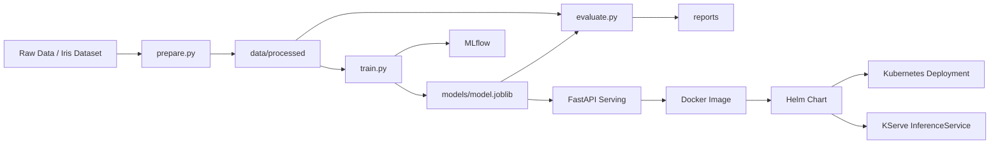

# MLOps with Git, DVC, MLflow, Kubernetes, and Helm

작은 규모의 MLOps 예제를 기준으로 학습 파이프라인, 실험 추적, 모델 서빙, Kubernetes 배포를 한 저장소에서 다루는 프로젝트입니다.

핵심 구성은 다음과 같습니다.

- `DVC`: 데이터 준비, 학습, 평가 파이프라인 재현
- `MLflow`: 학습 파라미터와 메트릭 추적
- `FastAPI`: 학습된 모델 서빙
- `Docker`: 서빙 이미지 빌드
- `Kubernetes`: 모델 서빙 배포
- `Helm`: 서빙 배포 템플릿화
- `KServe`: 선택적 모델 서빙 커스텀 리소스

## 아키텍처



## 문서

- 아키텍처 및 Helm 배포: `docs/mlops-architecture-and-helm-deployment.md`
- 운영 체크리스트: `docs/operations-checklist.md`
- 장애 대응 Runbook: `docs/incident-response-runbook.md`
- CI/CD 가이드: `docs/cicd-deployment-guide.md`
- 프로젝트 구조: `docs/project-structure.md`

## 저장소 구조

```text
configs/   pipeline and runtime config
data/      processed datasets
docs/      architecture and operation docs
infra/     docker, kubernetes, helm assets
models/    trained model artifacts
mlruns/    local mlflow tracking data
reports/   metrics and evaluation outputs
scripts/   local operation scripts
src/       application source code
```

주요 코드 위치:

- `src/pipelines/prepare.py`
- `src/pipelines/train.py`
- `src/pipelines/evaluate.py`
- `src/serving/api.py`
- `dvc.yaml`

## 빠른 시작

### 1. 로컬 환경 준비

Windows PowerShell 기준:

```powershell
.\scripts\bootstrap.ps1
Copy-Item .env.example .env
docker compose up -d
.\scripts\configure_dvc_remote.ps1
.\scripts\run_pipeline.ps1
```

직접 실행하려면:

```powershell
python -m venv .venv
.venv\Scripts\python.exe -m pip install -r requirements.txt
docker compose up -d
.\scripts\configure_dvc_remote.ps1
.venv\Scripts\dvc.exe repro
```

## DVC 파이프라인

현재 파이프라인 단계:

1. `prepare`
2. `train`
3. `evaluate`

실행:

```powershell
.venv\Scripts\dvc.exe repro
```

주요 산출물:

- `data/processed/train.csv`
- `data/processed/test.csv`
- `models/model.joblib`
- `reports/metrics.json`
- `reports/eval.json`

## MLflow와 로컬 인프라

`docker-compose.yml`은 로컬 개발용으로 다음 서비스를 제공합니다.

- `mlflow`
- `postgres`
- `minio`
- `api`

접속 정보:

- MLflow: `http://localhost:5000`
- MinIO API: `http://localhost:9000`
- MinIO Console: `http://localhost:9001`
- FastAPI: `http://localhost:8000`

## FastAPI 모델 서빙

로컬 실행:

```powershell
.venv\Scripts\python.exe -m uvicorn src.serving.api:app --host 0.0.0.0 --port 8000
```

엔드포인트:

- `GET /`
- `GET /health`
- `POST /predict`

예시 요청:

```powershell
$body = @{
  sepal_length = 5.1
  sepal_width = 3.5
  petal_length = 1.4
  petal_width = 0.2
} | ConvertTo-Json

Invoke-RestMethod -Method Post -Uri http://localhost:8000/predict -ContentType "application/json" -Body $body
```

기본 모델 경로:

- `models/model.joblib`

환경변수로 변경 가능:

- `MODEL_PATH`

## Kubernetes 배포

기본 매니페스트 배포:

```bash
kubectl apply -f infra/k8s/namespace.yaml
kubectl apply -f infra/k8s/mlflow-stack.yaml
kubectl apply -f infra/k8s/api-deployment.yaml
```

모델 서빙용 KServe custom resource 예제:

```bash
kubectl apply -f infra/k8s/model-serving-inferenceservice.yaml
```

주의:

- `infra/k8s/api-deployment.yaml`의 이미지 경로는 실제 레지스트리 값으로 바꿔야 합니다.
- `infra/k8s/model-serving-inferenceservice.yaml`을 쓰려면 클러스터에 KServe가 설치되어 있어야 합니다.
- `infra/k8s/mlflow-stack.yaml`의 secret 값은 예시 수준입니다.

## Helm 배포

Helm chart 위치:

- `infra/helm/mlops-serving`

환경별 values 파일:

- `infra/helm/mlops-serving/values-dev.yaml`
- `infra/helm/mlops-serving/values-staging.yaml`
- `infra/helm/mlops-serving/values-prod.yaml`

배포 모드:

- `mode: deployment`
- `mode: kserve`

기본 설치:

```bash
helm install mlops-serving ./infra/helm/mlops-serving -n mlops --create-namespace
```

KServe 활성화:

```bash
helm install mlops-serving ./infra/helm/mlops-serving -n mlops --create-namespace --set mode=kserve
```

운영값 파일 사용:

```bash
helm upgrade --install mlops-serving ./infra/helm/mlops-serving -n mlops --create-namespace -f ./infra/helm/mlops-serving/values-prod.yaml
```

배포 전 렌더링 검증:

```bash
helm template mlops-serving ./infra/helm/mlops-serving -n mlops -f ./infra/helm/mlops-serving/values-prod.yaml
```

운영값에서 먼저 확인할 항목:

- `image.repository`
- `image.tag`
- `mode`
- `deployment.replicaCount`
- `resources.requests`
- `resources.limits`
- `ingress.enabled`
- `secret.create`
- `persistence.enabled`

## CI/CD

GitHub Actions 워크플로 파일:

- `.github/workflows/ci-cd.yaml`

현재 CI/CD 흐름:

1. `dvc repro` 실행
2. 모델과 리포트 아티팩트 업로드
3. 서빙 이미지 로컬 빌드
4. `/health`, `/predict` smoke test 실행
5. GHCR 이미지 push
6. `helm template` 검증
7. Helm 기반 Kubernetes 배포

기본 이미지 태그 형식:

```text
ghcr.io/<owner>/mlops-api:<git-sha>
```

필요한 GitHub Secrets:

- `KUBECONFIG`

## 권장 운영 순서

1. `dvc repro`로 모델 학습 및 평가
2. `models/model.joblib` 생성 확인
3. API 이미지 빌드 및 레지스트리 push
4. `values-prod.yaml` 이미지 값 수정
5. `helm template`로 렌더링 검증
6. `helm upgrade --install`로 배포
7. `kubectl get`, `kubectl logs`로 상태 확인

## 다음 개선 항목

- 모델 파일을 외부 아티팩트 저장소 연동 방식으로 확장
- Helm chart에서 `Deployment`와 `InferenceService` 배포 조건을 더 명확히 분리
- MLflow, MinIO, PostgreSQL도 Helm chart 또는 별도 chart로 관리 범위 확장
- KServe 사용 시 autoscaling, canary rollout, revision 관리 전략 추가
- 이미지 빌드 단계에서 모델 파일 존재 여부와 서빙 시작 검증 자동화
- deploy 이후 cluster-level smoke test와 synthetic monitoring 추가
- 운영 환경용 secret, ingress, TLS, PVC 구성을 별도 values 파일로 분리
