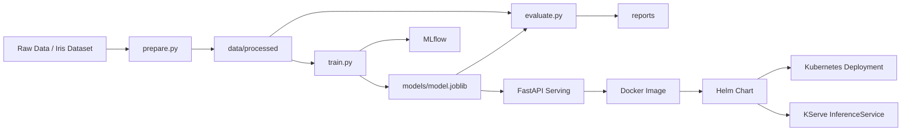

# MLOps 아키텍처와 Helm 배포 순서

## 1. 개요

이 저장소는 작은 규모의 MLOps 예제를 기준으로 다음 흐름을 갖습니다.

- 데이터 준비: `src/pipelines/prepare.py`
- 모델 학습: `src/pipelines/train.py`
- 모델 평가: `src/pipelines/evaluate.py`
- 모델 서빙: `src/serving/api.py`
- 파이프라인 관리: `dvc.yaml`
- 실험 추적: `MLflow`
- 서빙 배포: `Kubernetes`, `Helm`, 선택적으로 `KServe`

핵심 산출물은 다음입니다.

- 학습 데이터: `data/processed/`
- 모델 아티팩트: `models/model.joblib`
- 평가 리포트: `reports/`
- 로컬 MLflow 추적 데이터: `mlruns/`

## 2. 전체 아키텍처

### 구성 요소

1. `DVC`
   데이터 준비, 학습, 평가 단계를 재현 가능한 파이프라인으로 관리합니다.
2. `MLflow`
   학습 파라미터, 메트릭, 모델 아티팩트를 추적합니다.
3. `FastAPI`
   학습된 모델을 로드하고 `/health`, `/predict` API를 제공합니다.
4. `Docker`
   학습/서빙 환경을 컨테이너 이미지로 패키징합니다.
5. `Kubernetes`
   서빙 애플리케이션을 배포하고 운영합니다.
6. `Helm`
   Kubernetes 서빙 배포를 템플릿화하고 환경별 값으로 관리합니다.
7. `KServe`
   필요할 때 모델 서빙용 커스텀 리소스 `InferenceService`를 사용합니다.

### 아키텍처 다이어그램



## 3. 학습 및 서빙 흐름

### 학습 흐름

1. `prepare.py`가 원본 데이터를 학습/평가 데이터셋으로 분리합니다.
2. `train.py`가 모델을 학습하고 `models/model.joblib`를 저장합니다.
3. 같은 단계에서 MLflow에 파라미터와 메트릭을 기록합니다.
4. `evaluate.py`가 평가 결과를 `reports/eval.json`에 저장합니다.
5. 이 전체 흐름은 `dvc.yaml`로 관리됩니다.

### 서빙 흐름

1. `src/serving/api.py`가 애플리케이션 시작 시 모델 파일을 로드합니다.
2. `/health`는 모델 로드 상태를 반환합니다.
3. `/predict`는 입력 피처를 받아 예측 결과와 클래스명을 반환합니다.
4. 이 서비스는 Docker 이미지로 빌드되어 Kubernetes에 배포됩니다.

## 4. Helm 차트 구조

Helm chart 위치:

- `infra/helm/mlops-serving/Chart.yaml`
- `infra/helm/mlops-serving/values.yaml`
- `infra/helm/mlops-serving/values-dev.yaml`
- `infra/helm/mlops-serving/values-staging.yaml`
- `infra/helm/mlops-serving/values-prod.yaml`
- `infra/helm/mlops-serving/templates/deployment.yaml`
- `infra/helm/mlops-serving/templates/service.yaml`
- `infra/helm/mlops-serving/templates/inferenceservice.yaml`
- `infra/helm/mlops-serving/templates/secret.yaml`
- `infra/helm/mlops-serving/templates/pvc.yaml`
- `infra/helm/mlops-serving/templates/ingress.yaml`

역할은 다음과 같습니다.

- `values.yaml`
  기본 개발/예제 배포 값입니다.
- `values-dev.yaml`
  개발 환경용 값입니다.
- `values-staging.yaml`
  스테이징 환경용 값입니다.
- `values-prod.yaml`
  운영 배포를 위한 기본값입니다.
- `deployment.yaml`
  FastAPI 서빙용 `Deployment`를 생성합니다.
- `service.yaml`
  FastAPI 서빙용 `Service`를 생성합니다.
- `inferenceservice.yaml`
  `mode: kserve`일 때 `InferenceService`를 생성합니다.
- `secret.yaml`
  환경변수 주입용 Secret을 선택적으로 생성합니다.
- `pvc.yaml`
  모델 저장용 PVC를 선택적으로 생성합니다.
- `ingress.yaml`
  표준 Deployment 모드에서 Ingress를 선택적으로 생성합니다.

## 5. 배포 전 준비사항

Helm 배포 전에 다음이 준비되어야 합니다.

1. Kubernetes 클러스터에 접근 가능해야 합니다.
2. 배포를 실행하는 환경에 `kubectl`, `helm`이 설치되어 있어야 합니다.
3. 서빙 이미지가 레지스트리에 push되어 있어야 합니다.
4. `values-prod.yaml`의 이미지 경로와 태그가 실제 값이어야 합니다.
5. `kserve.enabled=true`를 사용할 경우 클러스터에 KServe CRD와 컨트롤러가 설치되어 있어야 합니다.

## 6. 권장 배포 순서

### 1. 모델 학습 및 검증

로컬에서 파이프라인 실행:

```powershell
.\scripts\run_pipeline.ps1
```

또는 직접 실행:

```powershell
.venv\Scripts\dvc.exe repro
```

이 단계에서 확인해야 할 결과:

- `models/model.joblib`
- `reports/metrics.json`
- `reports/eval.json`

### 2. 서빙 이미지 빌드 및 푸시

```powershell
docker build -f infra/docker/api.Dockerfile -t ghcr.io/<owner>/mlops-api:<tag> .
docker push ghcr.io/<owner>/mlops-api:<tag>
```

CI를 사용할 경우 `.github/workflows/ci-cd.yaml`이 이 과정을 수행할 수 있습니다.

### 3. Helm 운영 값 수정

수정 대상:

- `infra/helm/mlops-serving/values-prod.yaml`

최소 수정 항목:

- `image.repository`
- `image.tag`

상황에 따라 조정할 항목:

- `deployment.replicaCount`
- `resources.requests`
- `resources.limits`
- `service.type`
- `kserve.enabled`

### 4. Helm 템플릿 사전 검증

```bash
helm template mlops-serving ./infra/helm/mlops-serving -n mlops -f ./infra/helm/mlops-serving/values-prod.yaml
```

확인 포인트:

- 배포 이미지가 올바른지
- replica 수가 기대값인지
- 리소스 제한이 들어갔는지
- `kserve.enabled=true`일 때 `InferenceService`가 포함되는지

### 5. 네임스페이스 및 기반 리소스 배포

네임스페이스 생성:

```bash
kubectl apply -f infra/k8s/namespace.yaml
```

MLflow, PostgreSQL, MinIO까지 클러스터 내부에 같이 올리려면:

```bash
kubectl apply -f infra/k8s/mlflow-stack.yaml
```

### 6. Helm으로 모델 서빙 배포

```bash
helm upgrade --install mlops-serving ./infra/helm/mlops-serving -n mlops --create-namespace -f ./infra/helm/mlops-serving/values-prod.yaml
```

이 명령은 현재 차트 기준으로 다음을 배포합니다.

- `Deployment`
- `Service`
- 선택적 `InferenceService`

### 7. 배포 후 검증

기본 확인:

```bash
kubectl get pods -n mlops
kubectl get svc -n mlops
kubectl get deployments -n mlops
```

KServe를 쓴 경우:

```bash
kubectl get inferenceservices -n mlops
```

문제 분석:

```bash
kubectl describe deployment mlops-serving-mlops-serving -n mlops
kubectl logs deployment/mlops-serving-mlops-serving -n mlops
```

## 7. 배포 패턴

### 패턴 A. 일반 Kubernetes 배포

적합한 경우:

- 단순한 API 배포면 충분할 때
- KServe가 아직 클러스터에 없을 때
- 운영 복잡도를 낮추고 싶을 때

권장 설정:

```yaml
kserve:
  enabled: false
```

### 패턴 B. KServe 기반 배포

적합한 경우:

- 클러스터가 이미 KServe를 사용 중일 때
- 모델 서빙 전용 리소스 체계를 도입하려 할 때
- 향후 canary, autoscaling, multi-model 패턴으로 확장할 계획이 있을 때

권장 설정:

```yaml
kserve:
  enabled: true
```

주의:

- `kserve.enabled=true`일 때도 현재 차트는 기본 `Deployment`를 함께 만들 수 있습니다.
- 운영 정책상 둘 중 하나만 쓰고 싶다면 이후 chart 조건을 더 분리하는 것이 좋습니다.

## 8. 현재 저장소 기준 운영 순서 요약

1. `dvc repro`로 학습 파이프라인 실행
2. `models/model.joblib` 생성 확인
3. 서빙 이미지 빌드 및 레지스트리 푸시
4. `values-prod.yaml`의 이미지 값 수정
5. `helm template`로 렌더링 결과 검토
6. `helm upgrade --install`로 배포
7. `kubectl get`과 `kubectl logs`로 상태 확인

## 9. 다음 개선 권장사항

- `values-dev.yaml`, `values-staging.yaml`, `values-prod.yaml`로 환경 분리
- Helm chart가 `Deployment`와 `InferenceService`를 완전히 분기하도록 조건 정리
- 모델 파일을 이미지 내 포함 방식이 아니라 외부 아티팩트 저장소 연동 방식으로 확장
- GitHub Actions 배포 단계도 Helm 기준으로 일원화
